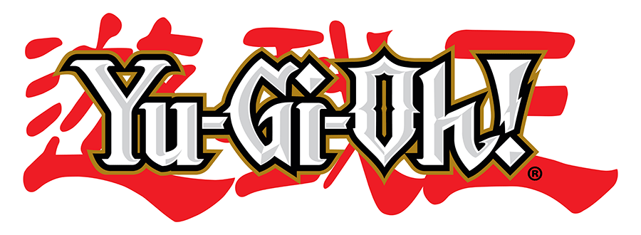

# YGO Deck Builder

Uma pequena ferramenta front-end para buscar cartas do Yu-Gi-Oh!, montar decks e exportar listas/imagens.



## Sobre

Este repositório contém uma aplicação estática (HTML/CSS/JS) chamada **YGO Deck Builder**. Ela consome a API pública do YGOPRODeck para buscar informações de cartas, permite adicionar cartas a um deck principal ou extra, exportar listas em `.txt`/`.json` e baixar imagens em `.zip`.

Principais objetivos:
- Buscar cartas por nome (com suporte a português/inglês).
- Montar e gerenciar um deck (limites por deck e por carta aplicados).
- Exportar deck como `.txt` ou `.json` e baixar imagens em lotes.

## Estrutura do projeto

- `index.html` — página principal.
- `assets/css/styles.css` — estilos.
- `assets/js/app.js` — lógica da aplicação.
- `assets/img/` — imagens (logo, placeholders).

## Como usar (modo rápido)

Como este projeto é um site estático, a forma mais simples de rodar localmente é abrir `index.html` no seu navegador. Para um comportamento mais fiel (evitar problemas de CORS e permitir downloads), é recomendado servir por um servidor HTTP local.

No PowerShell (Windows) com Python instalado:

```powershell
python -m http.server 8000
# depois abra http://localhost:8000 no navegador
```

Ou usando `npx` (Node.js):

```powershell
npx http-server -p 8000
# depois abra http://localhost:8000 no navegador
```

## Endpoints e dependências externas

- A aplicação usa a API pública do YGOPRODeck: `https://db.ygoprodeck.com/api/v7`.
- Para criar ZIPs e forçar o download de arquivos, a página inclui CDN de `JSZip` e `FileSaver` (essas dependências são carregadas diretamente no `index.html`).

## Boas práticas e limitações

- A aplicação evita requisições massivas, mas ao baixar muitas imagens o usuário é avisado.
- Persistência simples via `localStorage` (chave: `ygodb_decks_v1`).
- Limite por carta: 3 cópias; limite de 60 para deck principal e 15 para deck extra.

## Contribuir

Contribuições são bem-vindas! Sugestões úteis:

1. Abra uma issue descrevendo a proposta.
2. Faça um fork, crie uma branch com FEA-tipo e envie um pull request.

Checklist sugerido para PRs:
- [ ] Rodar o site localmente e validar a busca de cartas.
- [ ] Garantir que não haja quebras visuais em telas menores.


## Créditos

- API de dados: YGOPRODeck — https://db.ygoprodeck.com

